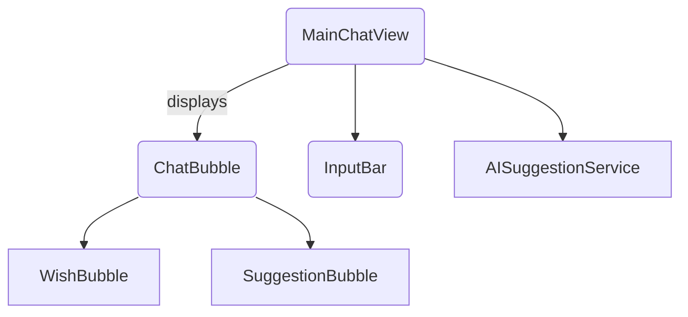

# Remove Services and ViewModel

This refactor aligns Wishle with the command pattern used in Incomes and Cookle. Service and ViewModel layers were removed in favour of direct `AppIntent` commands and view logic.

## Removed Classes

- `WishService`
- `MainChatViewModel`

## New Flow

`MainChatView` now interacts with SwiftData and `AISuggestionService` directly.
