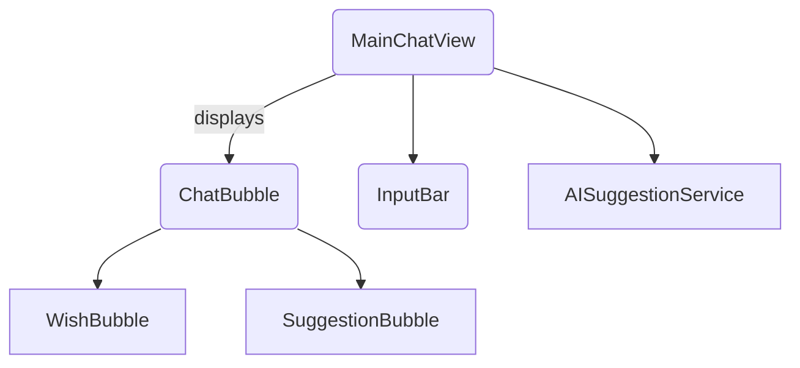

# Main Chat Flow

The main chat screen lists wishes chronologically and mixes in AI suggestions. Components are organised as follows:

`MainChatView` loads wishes directly from SwiftData and fetches suggestions from `AISuggestionService`. Bubbles render each item, and the `InputBar` lets users add new wishes.

Use `MainChatView()` as the root view of the app.
